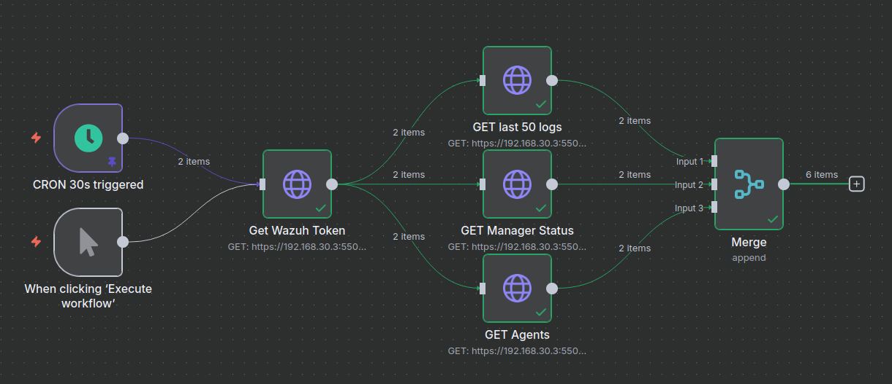
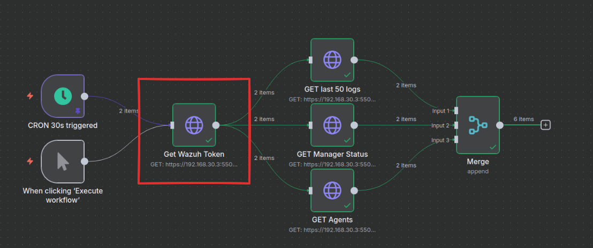
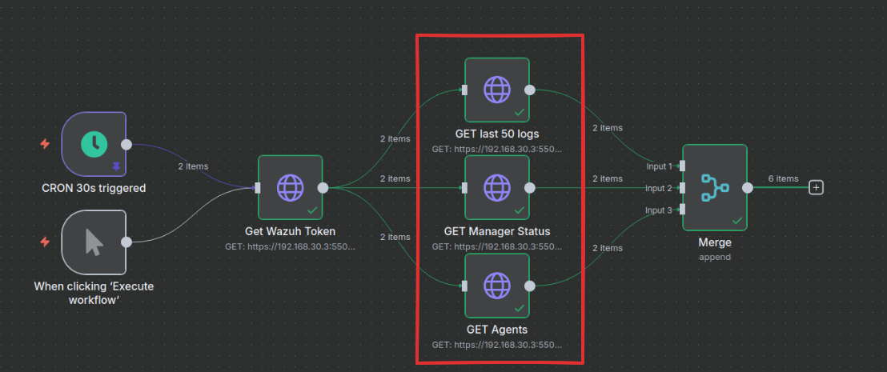
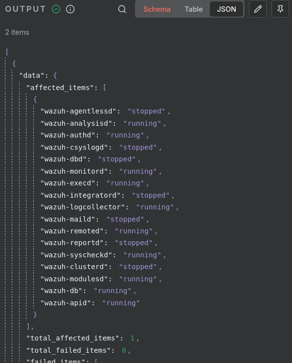

# n8nWazuhAPI
StepByStep guide: How to make queries to the Wazuh API with an n8n workflow.



This implementation was created for a testing lab. It is not recommended in production environments.

### My testing environment:

I have **connected both containers using an internal docker network**. You can create it by using the [network script](./network_manage.sh)

1. Wazuh 4.13 Docker single-node deploy: [documentation](https://documentation.wazuh.com/current/deployment-options/docker/wazuh-container.html). You will have to modify it to connect the containers to the **n8n_network** internal network.

2. A n8n container created with this [docker-compose.yml](./docker-compose.yml). It was created based on the [official n8n documentation](https://docs.n8n.io/hosting/installation/docker/#starting-n8n)

Once the containers have been created and have connectivity between them, we can proceed with the basic implementation.

### Step by step guide:
1. **Getting the token:**

Configuration:
    - Method: GET
    - URL: https://<manager ip in n8n_network>:55000/security/user/authenticate
    - Authentication: Generic Credential Type
    - Generic Auth Type: Basic Auth
    - Basic Auth: You have to insert the API credentials. You can find the default values [here](https://hub.docker.com/r/wazuh/wazuh-manager)
    - Options > Ignore SSL Issues: enable
    - Response > Response Format: JSON

Result:
    - Once you execute this step successfully, you will obtain the API token on the output.

2. **Using the token:**

Now, you have access to the Wazuh API so we are going to perform some queries. I have configured 3 different ones. For example, here is how we can get the manager status.
Configuration:
    - Method: GET
    - URL: https://<manager ip in n8n_network>:55000/manager/status
    - Authentication: None
    - Send Headers: enable
    - Specify Headers: Using JSON
        JSON: 
        ```
        {
            "Authorization": "Bearer {{$json["data"]["token"]}}"
        }
        ```
    - Options > Ignore SSL Issues: enable
    - Response > Response Format: JSON

Result:
    - You might be seeing an output like this one:
    


Once you have the API token, you can configure whatever query you want. This workflow works exactly as the API console that you find in the Wazuh Dashboard. For example, I configure it to show the last 50 logs received on the manager and to list the enrolled agents. You can also customize your workflow with a timer or a merger as I did.

This is only a technical base for lab testing. Now it is very easy to connect the API output to some LLMs to automatically analyze the output or even to configure intelligent custom alerting.

 I hope it proves helpful.